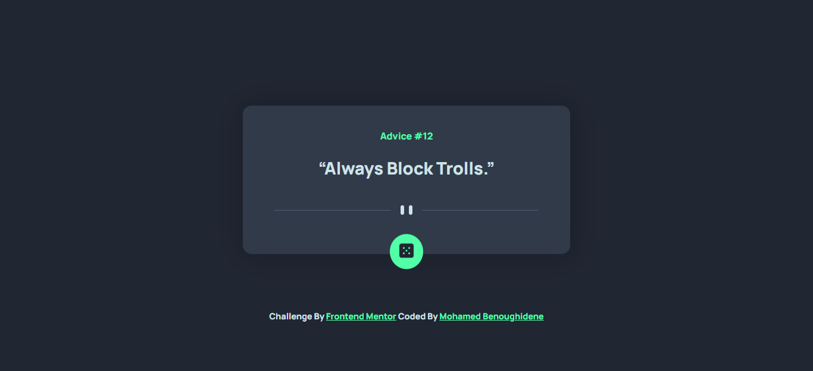

# Frontend Mentor - Advice generator app solution

This is a solution to the [Advice generator app challenge on Frontend Mentor](https://www.frontendmentor.io/challenges/advice-generator-app-QdUG-13db).

## Table of contents

- [Overview](#overview)
  - [The challenge](#the-challenge)
  - [Screenshot](#screenshot)
  - [Links](#links)
  - [Built with](#built-with)
  - [What I learned](#what-i-learned)
- [Author](#author)

## Overview

The challenge is to build out this advice generator app using the [Advice Slip API](https://api.adviceslip.com) and get it looking as close to the design as possible.

### The challenge

Users should be able to:

- View the optimal layout for the app depending on their device's screen size
- See hover states for all interactive elements on the page
- Generate a new piece of advice by clicking the dice icon

### Screenshot



### Links

- Solution URL: [Add solution URL here](https://www.frontendmentor.io/challenges/advice-generator-app-QdUG-13db/hub/advice-generator-react-scss-axios-sDksavFYv)
- Live Site URL: [Add live site URL here](https://advice-generator-bm.netlify.app/)

### Built with

- Jsx
- Scss
- Flexbox
- Mobile-first workflow and Desktop-first workflow (a mix)
- [React](https://reactjs.org/) - JS library
- axios - to get the API

### What I learned

I Learned to use axios this is my first time using it.

```
const [quote, setQuote] = useState([]);
const axios = require('axios');
    axios.get(`https://api.adviceslip.com/advice/${x}`)
        .then(function (response) {
            setQuote(response.data.slip.advice);
            setQuoteId(response.data.slip.id);
        })
        .catch(function (error) {
            console.log(error);
        })

```

## Author

- Frontend Mentor - [@mohamed-benoughidene](https://www.frontendmentor.io/profile/mohamed-benoughidene)
